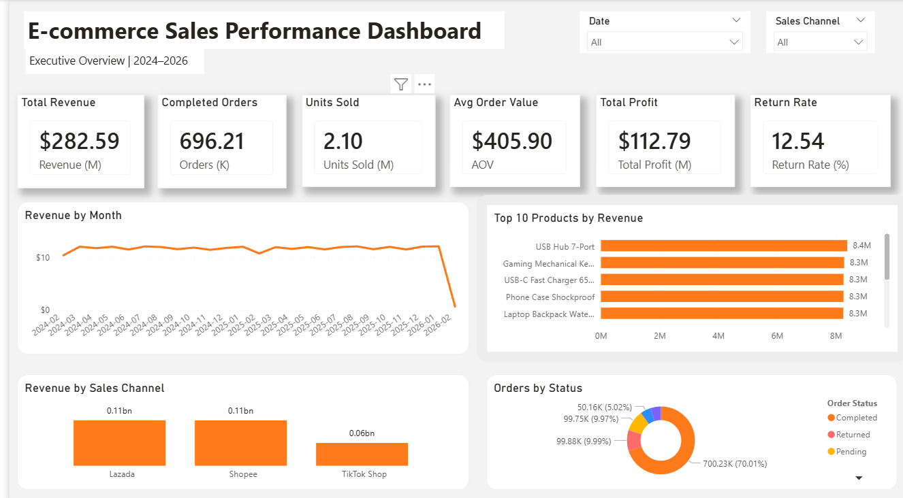
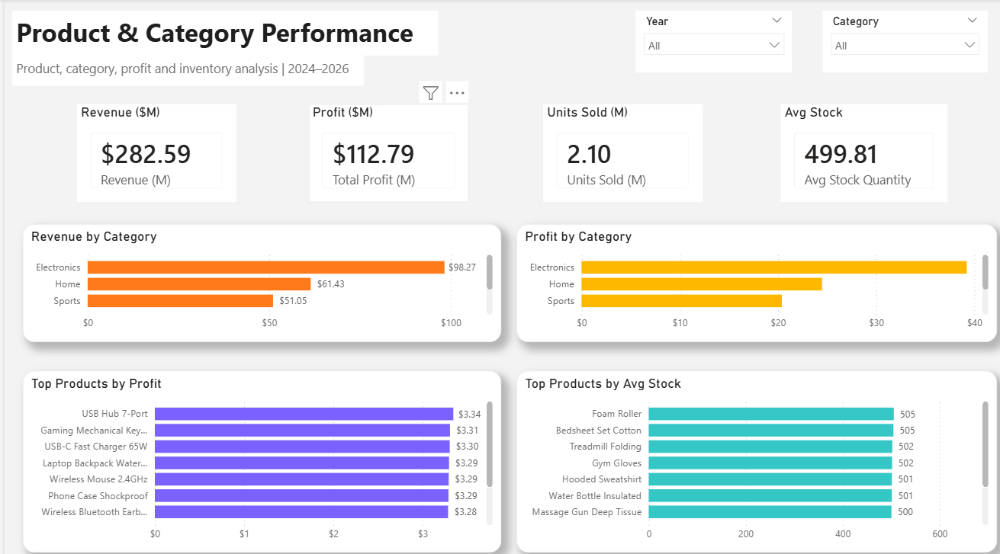
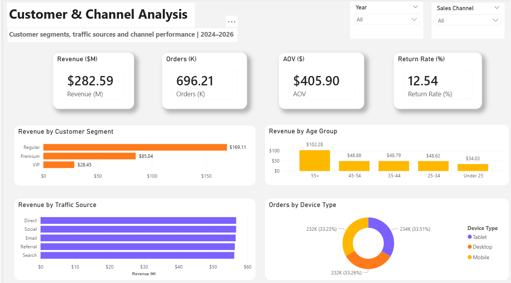

# E-commerce Sales Performance Dashboard

## 1. Project Overview

This project analyzes e-commerce sales performance using Power BI. The dashboard is designed to monitor key business metrics such as revenue, completed orders, units sold, average order value, total profit, return rate, product performance, customer segments, traffic sources and sales channels

The project simulates a real-world e-commerce analytics workflow, including data preparation, KPI calculation, dashboard design, insight generation, and business recommendations

## 2. Dataset

The main dataset used in this project is a large-scale synthetic e-commerce dataset from Kaggle:

**Global E-Commerce Dataset (+1M Records, 2024–2026)**

The dataset contains transaction-level e-commerce data, including order information, customer attributes, product details, pricing, profit, stock quantity, traffic source, device type and order status

> Note: This is a synthetic dataset used for learning and portfolio purposes. Some fields, such as stock quantity, are treated as indicative operational metrics rather than real-time inventory balances

## 3. Tools Used

* Power BI
* Power Query
* DAX
* Excel
* GitHub

## 4. Dashboard Pages

### Page 1: Executive Overview

This page provides a high-level summary of overall business performance

Key metrics and visuals:

* Total Revenue
* Completed Orders
* Units Sold
* Average Order Value
* Total Profit
* Return Rate
* Revenue by Month
* Top Products by Revenue
* Revenue by Sales Channel
* Orders by Status

### Page 2: Product & Category Performance

This page focuses on product and category-level performance

Key metrics and visuals:

* Revenue by Category
* Profit by Category
* Top Products by Profit
* Top Products by Average Stock
* Units Sold
* Average Stock Quantity

### Page 3: Customer & Channel Analysis

This page analyzes customer segments, age groups, traffic sources, sales channels and device types

Key metrics and visuals:

* Revenue by Customer Segment
* Revenue by Age Group
* Revenue by Traffic Source
* Orders by Device Type
* Average Order Value
* Return Rate

## 5. Key Insights

* Electronics is the leading product category in both revenue and profit, indicating that this category is a major business driver
* Regular customers generate the highest revenue among customer segments, suggesting that the main revenue base comes from mass-market customers rather than only high-tier segments
* Lazada and Shopee are the two leading sales channels, while TikTok Shop contributes lower revenue compared with the other channels
* Revenue is distributed across multiple traffic sources, including Direct, Social, Email, Referral, and Search, showing the importance of maintaining multiple acquisition channels
* Orders are relatively evenly distributed across desktop, mobile, and tablet, which suggests that the shopping experience should be optimized across devices
* Products with high average stock should be monitored together with revenue and profit performance to reduce potential overstock risk
* The sharp drop in February 2026 should be interpreted carefully because the dataset may only contain partial data for that month

## 6. Business Recommendations

* Prioritize high-revenue and high-profit categories such as Electronics when planning promotions, inventory and merchandising strategies
* Monitor products with high average stock but lower profit contribution to reduce potential overstock risk
* Continue optimizing multiple traffic sources instead of relying on a single acquisition channel
* Strengthen engagement strategies for Regular customers, as they contribute the largest share of revenue
* Ensure the e-commerce experience is consistent across desktop, mobile, and tablet because order volume is relatively balanced across device types
* Treat incomplete months carefully in time-series analysis to avoid misleading business conclusions

## 7. Dashboard Preview

### Executive Overview



### Product & Category Performance



### Customer & Channel Analysis



## 8. Project Files

```text
ecommerce-sales-performance-dashboard/
│
├── docs/
│   └── insights.md
│
├── screenshots/
│   ├── executive_overview.png
│   ├── product_category.png
│   └── customer_channel.png
│
└── README.md
```

> Note: The Power BI `.pbix` file is not included in this repository due to GitHub file size limitations. Dashboard screenshots and project documentation are provided for review. The Power BI file can be shared upon request

## 9. What I Learned

Through this project, I practiced:

* Cleaning and preparing e-commerce data in Power Query
* Creating DAX measures for business KPIs
* Designing a multi-page Power BI dashboard
* Building executive-level and operational-level dashboard pages
* Translating data analysis into business insights and recommendations
* Presenting a data analytics project professionally on GitHub
## 10. Project Status

Completed
